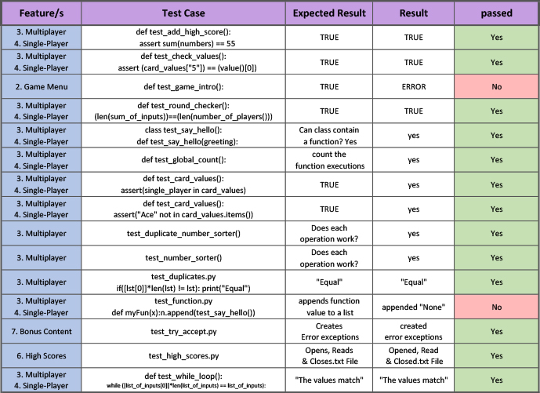

# <p style="text-align:center"> ZAPP - Zombie Apocalypse Planning Poker</p>
### Video Presentation - https://www.youtube.com/watch?v=WAXMrl4ehB4
### Application Demonstration - https://www.youtube.com/watch?v=COlVYZz_xPA

### Source Control Repository - https://github.com/JamJuiceCreative/T1A3---Terminal-Application

### Project Management Platform - https://trello.com/b/1Fb6TSx0/

___


## <p style="text-align:center">Help for executing program;</p>
___
### Instructions for running zapp.sh;

1. running zapp.sh inside the "src" directory folder should execute the program as it;
- checks if python3 is installed
- Installs python3 if it's not found
- checks if the required packages are installed
- installs required packages if needed

        ./zapp.sh

* *if simply typing ./zapp.sh into the terminal doesn't execute the program please* follow the steps below.

2. In ubuntu (linux) terminal check if python is installed:

        python -V
            Python 3.12.0a2

3. If python is not installed or it's an outdated version;
    Download the latest version of python:

        sudo apt install python3

4. Make sure the following packages are installed in your system;

        art==5.8
        colored==1.4.4

* *if you require pytest to run some of the assertions tests in the "test" folder;*
 make sure you have;
    
        attrs==22.1.0
        iniconfig==1.1.1
        packaging==22.0
        pluggy==1.0.0
        pytest==7.2.0


5. If any are missing; (for example - colored)

        pip install colored

* *or just activate the virtual environment*<br>
from inside "ZAPP" directory folder;

        source venv/bin/activate

6. finally run executable file zapp.sh;

        ./zapp.sh

## <p style="text-align:center">-----------------RULES----------------</p>
<p style="text-align:center">---ZOMBIE APOCALYPSE PLANNING POKER---</p>

ZAPP is a consensus card game based off of
planning poker or scrum poker only it's the 
end of the world and a zombie apocalypse!

1. From a range of cards; 
'Ace', '2', '3', '5', '8', 'King'.
You and your fellow survivors must determine the
difficulty of a challenge by each throwing a card.

2. Ace being the challenge is easy and 8 being the 
task is hard. Throwing a 'King'; the challenge is 
impossible and you will skip the round and move on 
to the next.

3. If you all throw different cards, you will each 
throw again until you have reached a consensus and 
have all thrown the same card.

4. The game will then evaluate your groups decisions
against the difficulty rating of the challenge and
determine whether you succeeded or failed. 

5. Success will award points based on the difficulty 
of the challenge however your overall score will be
penalised incrementally based on the value of the
cards you all agreed upon. 

In other words, the lower the card, the less valuable
resources like guns, ammo, food and people you'll need
to expend. But you'll still need to pass the challenge
or you're coming home empty handed.  

Have fun survivor and good luck!!!

# <p style="text-align:center">Project Overview;</p>

I wanted to create a terminal app that would feature a game that would be familiar to those in the programming world. That way I would have the frame work for a program that would potentially be useful in a programming or development environment. I chose "planning poker" or "scrum poker" as it fulfilled this requirement however to make it more interesting I based it around the zombie apocalypse.

## List of program features;
* Game Intro
* Game Menu
  * while loop that requests user input to perform the games main functions and ends when user selects to quit the program.
* Multi-player Mode
  * Runs the game for 3 human players to play at the terminal and therefor relies on human intelligence to pick cards within the range of cards already thrown for each round.   
  * Requests user inputs for each player and [error handles] if players don't put in one the of designated selections.
  * Compares the user inputs to see if they're all the same
     - Runs the round again until they are.
  * Checks to see if the value of the card the users agreed upon is equal or above the required value to pass the challenge.
    - if the card value is equal to or above the challenge value appends the score from the challenge, applies the penalty value and continues to next challenge.
    - if the card value is less than the challenge value round is failed and continues to next challenge.
  * Once all challenges are completed, failed or skipped adds up the scores and allows user to enter the score into the file handling.
  * Returns to the main menu.

* Single Player Mode
  * Runs the game to be played against the computer which therefor must determine that the computer can only throw cards with the range of cards already thrown within the round.
  * The program prompts the user to throw the first card.
  * A throw card function runs which gets the computer to make a random choice from the full card range. 
  * Once again compares user inputs alongside computer inputs and checks to see if they're all the same.
  * This time if the cards are not the same a function runs to check if there are any duplicate cards.
    - if there are; a duplicate number sorter function runs that determines the new range of cards to throw from, so that the computer won't try to throw outside of it.
    - if there aren't; a regular number sorter runs to determine the new range so that the the computer won't try to throw outside of it.
  * Once again checks to see if the value of the agreed upon card is equal or above the required value to pass the challenge.
    - if the card value is equal to or above the challenge value appends the score from the challenge, applies the penalty value and continues to next challenge.
    - if the card value is less than the challenge value round is failed and continues to next challenge.
  * Once all challenges are completed, failed or skipped adds up the scores and allows user to enter the score into the file handling.
  * Returns to the main menu. 
* Rules
  * File Handling for read only of the game rules in a text file. 
* High Scores
  * File Handling for read only of the high scores which are printed and arranged with the High Score at the top. (The writing aspect of the file handling is written into the main game.)
* Bonus Content
  * Created to demonstrate understanding of try/except error handling. The input requires a number but if you enter a string the program handles the error with a hidden feature. Also includes some file handling.

## Implementation Plan;

My original implementation plan (which evolved over the course of the project) began with creating the functionality of the planning poker game first. Because I wanted a single player mode and a multi-player mode, I determined that the multi-player would be best to tackle first because it can rely on human intelligence to reach consensus. That way I would have the frame-work to build from and develop the single player mode where you need to make sure the computer won't throw outside of the range that has been previously thrown. Once the games were functional my plan was to incorporate file handling with the high score feature and that would include the ability to add high scores, so some reading and writing within the file handling. Next I would create the menu to give the user access to the features within and finally if time permitted a little intro and some ascii art which I was keen to have a crack at creating some.

I created all of the elements utilising a TDD approach essentially creating all of the functions in a test environment first and then bringing them across into my program once I was satisfied with their functionality. 

### Feature 1. Multi-Player Mode;
* Develop First to determine overall frame work for the games. 
* Initialise Player Class so that number of players can be scaled.
* Define only 3 player objects initially in order to keep development small scale.
* Initialise Challenges Class so that number of challenges can be scaled.
* Define only 3 challenge objects initially in order to keep development scale down.
* Implement for loop in multiplayer function to determine number of rounds based on number of players.
* Design player turn function to determine steps for each player turn.(While loop)
* Create scoring system and feature to add the scores to the high scores list.
### Feature 2. Single-Player Mode;
* Use initial frame work from Multi-Player Mode.
* Develop a random throw card function.
* Program a number sorter to make sure computer doesn't throw outside of new ranges.
* Program a duplicate number sorter to account for duplicate cards thrown.
* Test and Debug ALOT
### Feature 3. High Scores;
* Author a dummy high scores list in a text file. 
* Perform file handling tasks ie; make the file readable.
* Incorporate some file writing within the game itself.
* Make the high scores sort as to read highest top to bottom. 
* Fix the bug where numbers sorted method doesn't account for zeros as a list in lines.
### Feature 4. Rules;
* Author a text document outlining the game rules.
* Perform file handling to incorporate reading of the rules from the game menu.
* Incorporate some Error Handling within.
### Feature 5. Bonus Content;
I designed my program to basically account for any user input either being accepted or returning invalid selection statements, so it's impossible for the user to throw an error and break the program. I added a bonus feature to demonstrate my understanding of Error Handling using the try/except statements.
* Design a function that deliberately throws a ValueError. User input asks for name, but in-fact requires an integer. 
* Instead of breaking the program except statement executes a read file function that displays a secret message from a text file. So it incorporates a little bit more file handling as well so it's 2 birds with one stone.
### Feature 6. Game Menu;
* Determine the games features.
* Create a function to print the list of features accessible to the player.
* Design a loop to allow user input and select which feature to execute.
* Once the features have been created run them from the menu. 
* Add any styling or colouring from external packages if time permits.
### Feature 7. Game Intro;
* Illustrate some ascii art to be utilised in introductory sequence if time permits. 

Project Management Platform: Trello<br>
https://trello.com/b/1Fb6TSx0/terminal-app-zapp-zombie-appocalypse-planning-poker<br>

Source Control Repository: GitHub<br>
https://github.com/JamJuiceCreative/T1A3---Terminal-Application<br>
Code Styling Conventions: Pep 8<br>
https://peps.python.org/pep-0008/

## Testing; 

So, as I have mentioned I tried to adopt a test-driven development approach to the entire project. Essentially, I developed all my code in test environments which not only helped to break down problems into smaller challenges but turned out to be a really good way to learn all of the python fundamentals through trial and error. So, I suppose you could break down my methodology into 3 types of testing. I utilised assertion testing with pytest. I performed quite a bit of manual testing. Also, some testing using print statements which I found super useful in some of the more challenging parts of the project.

### Assertion Tests;

```python
def test_round_checker():
    sum_of_inputs = [["King", "Ace", "2"],["King", "Ace", "2"],["King","Ace", "2"]]
    assert (len(sum_of_inputs))==(len(number_of_players()))
    print(len(sum_of_inputs))
    print(round)
```
```python
def test_card_values():   
  card_values={
        "Ace": 50,
        2: 100,
        3: 250,
        5: 500,
        8: 750,
        "king": 1000
    } 
  assert("Ace" not in card_values.items())
  assert(2 in card_values)
```
```python
numbers = [1,2,3,4,5,6,7,8,9,10]
def test_add_high_score():
  assert sum(numbers) == 55
```
```python
from utils.challenges import challenges
from utils.card_values import card_values
challenge1 = challenges("There's a survivor surrounded by a horde at the downtown mall", 250, False, 1000 )
challenge2 = challenges("There's an overturned supply truck on highway 99", 250, False, 1000)
challenge3 = challenges("There's military personnel shooting innocent survivors in the city central hospital", 400, False, 5000)
def which_challenge():
    challenge_list = [challenge1.challenge, challenge2.challenge, challenge3.challenge]
    return (challenge_list)
def score():
    score_list = [challenge1.score, challenge2.score, challenge3.score]
    return (score_list)
def value():
    value_list = [challenge1.value, challenge2.value, challenge3.value]
    return (value_list)
print(len(which_challenge()))
print(which_challenge())
print(score())
print(card_values["5"])
print(value()[0])
def test_check_values():
    assert (card_values["5"]) == (value()[0])
```
Manual Tests Spread Sheet;


Testing using print statements;
```python
    card_index2 = {i:j for i,j in card_index.items() if i not in card_index2}
    print("This puts the thrown cards in order:",card_index2)
    sorted_cards = sorted(card_index2.items(), key=lambda x:x[1])
    print("This converts it to a list of tuples:", sorted_cards)
    sorted_cards_slice = sorted_cards[1:-1]
    print("This removes the outside numbers",sorted_cards_slice)
    resultDictionary = dict((x, y) for x, y in sorted_cards_slice)
    print("This converts it back to a dictionary:", resultDictionary)
    card_range = {i:j for i,j in card_index2.items() if i not in resultDictionary}
    print("This gives the outside cards: ", card_range)
    card_tuple = sorted(card_index.items(), key=lambda x:x[1])
    print("This converts the original card index to a list of tuples",card_tuple)
    index_list = list(card_index)
    print("This converts card_index to a list:",index_list)
    outside_list = list(card_range)
    print("This prints the outside numbers by index:",outside_list[0], outside_list[1])
    card_range1= index_list.index(outside_list[0])
    print("This prints the index of the first outside value:",card_range1)
    card_range2= index_list.index(outside_list[1])
    print("This prints the index of the second outside value:",card_range2)
    remaining_cards = card_tuple[card_range1:card_range2+1]
    print("This give the list of remaining cards, inclusive of the outside cards:",remaining_cards)
    remaining_cards_dict = dict((x,y) for x, y in remaining_cards)
    remaining_cards_list = list(remaining_cards_dict)
    return(remaining_cards_list)
```
## <p style = "text-align:center"> References </p> 
Rules for Planning Poker - https://en.wikipedia.org/wiki/Planning_poker<br>
### External Packages; <br>
art 5.8 - https://pypi.org/project/art/ <br>
colored 1.4.4 - https://pypi.org/project/colored/ <br>